> 🇬🇧 **Read in English**: [README.md](README.md)

# 18 — Triple défense en profondeur pour agents IA en production

**Difficulté**: 🔴 Avancé  |  **Temps estimé**: 90 min

---

## Ce qu'on apprend

Trois couches architecturales qui se placent entre un appel à l'API Claude et une base de production, appliquées à des contextes d'agents non-codage (raisonnement financier, workflows médicaux, systèmes de conseil) :

1. **Isolation horizontale** — plusieurs instances Claude avec des portées différentes ; l'agent conversationnel n'a aucun tool d'écriture.
2. **Ordre vertical** — machine à états bloquante ; les méthodes refusent de tourner hors ordre, Python crash au lieu d'exécuter sur un mauvais état.
3. **Traçabilité longitudinale** — chaque appel Claude et chaque décision finale stockés avec leurs cross-checks. Auditable des mois plus tard, dans le même fichier SQLite que les données métier.

C'est le pattern qui aurait évité l'incident PocketOS (avril 2026, un agent IA a effacé toute une base de production en 9 secondes via une mutation GraphQL unique).

## Article compagnon

**Article long format sur Dev.to** (à lire en premier) :
*"AI agent governance: how I built triple defense in depth for production AI agents"* — [lien à ajouter à la publication]

L'article couvre le raisonnement complet, l'analyse de l'incident PocketOS, et une comparaison honnête avec Langfuse, pytransitions, et les subagents Claude Code.

## Snippets reproductibles

Trois snippets Python à copier dans votre projet :

- **[`01_tool_registry.py`](snippets/01_tool_registry.py)** — Pattern de registre de tools. 13 tools en lecture seule, 2 tools admin, 1 trigger fire-and-forget. **Aucun tool d'écriture n'existe dans le dispatcher.**
- **[`02_state_machine.py`](snippets/02_state_machine.py)** — Machine à états bloquante à 12 états avec `_advance_state` (5 lignes) et helpers de reprise après crash.
- **[`03_provenance.py`](snippets/03_provenance.py)** — Schémas SQLite pour `claude_calls` et `fv_reasoning`. Pattern d'insertion, exemples de requêtes.

## Diagramme d'architecture

## Ce qu'on construit

Une version minimale du pattern trois-couches en utilisant :
- Une clé API Anthropic (on peut utiliser la même clé pour clarté ; en prod on séparerait)
- SQLite comme unique couche de persistence (pas de service externe requis)
- Des validateurs Python purs entre le JSON renvoyé par Claude et les écritures DB

## Prérequis

- Python 3.10+
- Une clé API Anthropic
- Familiarité avec `tool_use` (couvert dans les tutos 5-7)
- Optionnel mais recommandé : lire les tutos 8-12 avant

## Statut

🚧 **Tuto en rédaction.** L'article compagnon et les snippets reproductibles sont déjà disponibles. La marche-à-marche pratique du tuto suivra.

**Star le repo** ([⭐ Star](https://github.com/Kryscekk/agents-in-practice)) pour être notifié de la sortie complète.
